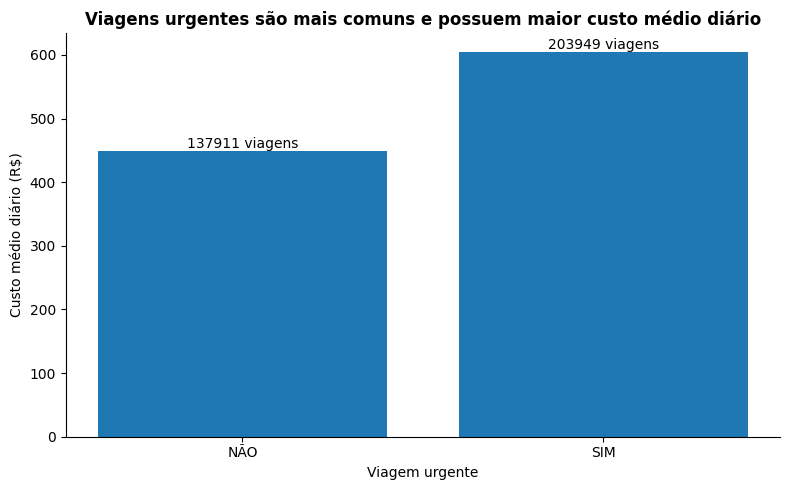
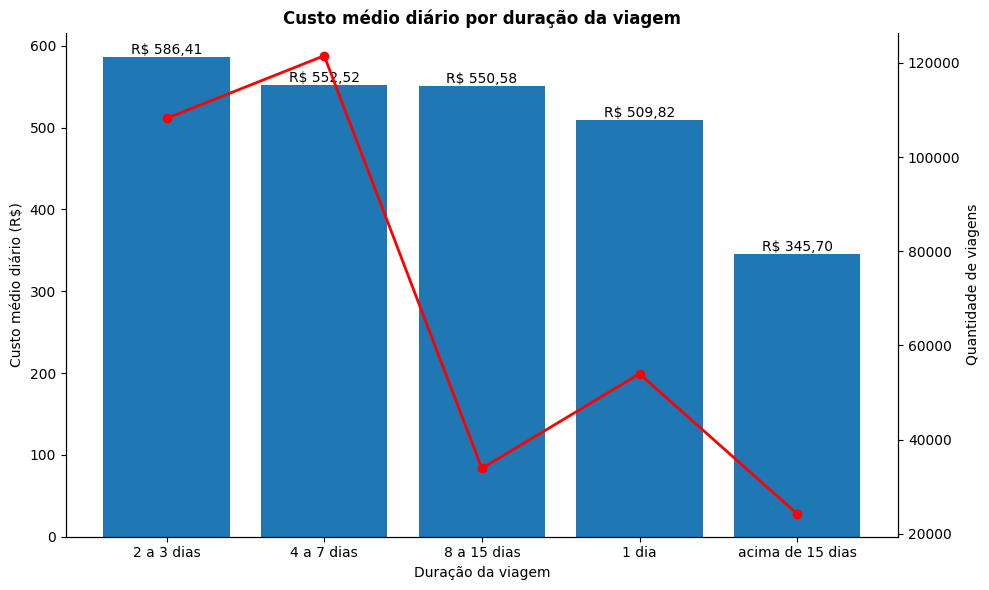
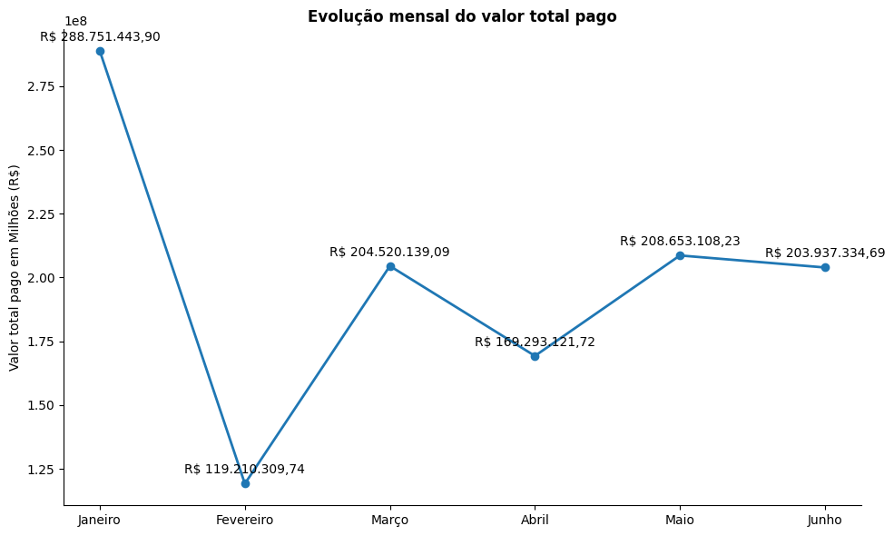
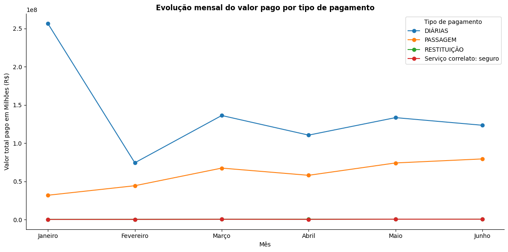
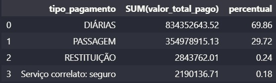
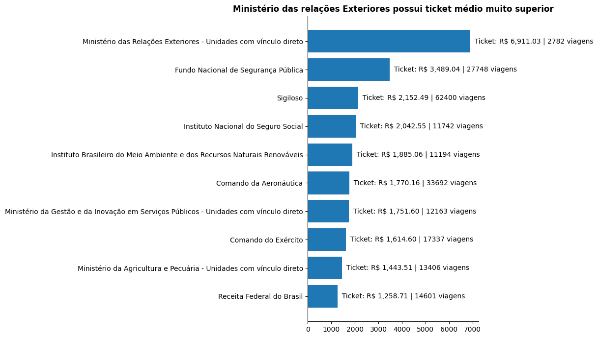

# projeto-final-RuanCarlosCostaGuths-T2

## Indicação

Os arquivos deste projeto estão no formato .py, .sql e .ipynb (notebooks). A versão do python utilizada foi a 3.14
Instale as seguintes extensões no seu VSCode para conseguir executar esse projeto:
- Python
- Jupyter Notebook
- SQLTools MySQL

Também instale as seguintes bibliotecas:
- mysql.connector
- dotenv
- pandas
- matplotlib.pyplot

## Objetivo

Importar, tratar e analisar dados de seis meses sobre custos de viagens do governo brasileiro, gerando um relatório respondendo perguntas de negócios valiosas 

## Tecnologias usadas

- VSCode
- Python
- Pandas
- MatPlotLib
- MySQL

## Dataset

Os dados utilizados estão na pasta 'data/raw', em formato .zip, onde contém 4 arquivos .csv sobre trechos, pagamentos, valores e outras informações sobre as viagens executadas pelo governo brasileiro e suas entidades que a compõe. Todos estes dados estão disponíveis no portal de transparência do governo.
Logo, o arquivo viagens_2025_6meses.zip contém os seguintes arquivos:
- 2025_Pagamento
- 2025_Passagem
- 2025_Trecho
- 2025_Viagem

## Importação, limpeza e tratamento dos dados

O projeto funciona com a criação de um banco de dados local para armazenar os dados. Seguindo o modelo de arquitetura Medallion, os dados foram armazenados na sua forma bruta na camada Raw - quatro tabelas que armazenam os dados na forma que chegaram. 
Em seguida, esses dados na camada Raw foram limpados, tratados e importados em outras quatro tabelas, que representam a camada Silver e foram utilizados para fazer algumas das análises finais. A limpeza e tratamento envolvem correção de valores errados, conversão de texto para seu formato correto e a criação de colunas de valores totais. 
Por fim, foi criado outra tabela, que representa a camada Gold, onde traz informações manipuladas das tabelas Silver, calculando valores de mais de uma coluna ou tabela para gerar novos dados derivados dos originais, como resumo mensal dos pagamentos. 

## Principais Insights

Analisando os dados da camada Silver, encontrou-se os seguintes fatos:

### Viagens Urgentes

- Mais da metade das viagens são consideradas urgentes (59,66%)
- O custo diário médio das viagens urgentes (R$ 604,49) são maiores que o custo diário médio das viagens não urgentes (R$ 448,74)
- Entre todas as viagens urgentes (203.949 viagens), 53.861 viagens urgentes (26,41% do total) possuem o custo diário maior que a média geral do custo diário das viagens não urgentes.

O gráfico acima mostra o custo médio diário das duas categorias de viagens (urgentes e não urgentes) e também a quantidade exata de viagens de cada uma dessas categorias, reforçando os pontos citados na análise acima.

Essas informações mostram que grande parte das viagens executadas pelo órgãos do governo não são planejadas com antecedência, o que aumenta o custo dessas viagens.

### Relação tempo de viagem X custo médio diário

Comparando o custo médio diário das viagens com a sua duração, encontra-se que:
- Viagens acima de 15 dias de duração possuem o menor custo médio diário
- Com exceção das viagens que duram apenas um dia, o restante das categorias segue uma relação inversa entre custo médio diário e duração, onde o custo diminui conforme a duração aumenta
- Como já citado, as viagens que duram apenas um dia fogem do padrão, sendo a segunda categoria com menor custo médio diário dentre as analisadas
- As viagens de duração de 4 a 7 dias são as mais presentes dentre todas as categorias, representando uma participação de aproximadamente 35,55% do total

O gráfico de barras acima demonstra a relação do custo médio diário com a duração das viagens, e a linha vermelha representa o comportamento da quantidade de viagens em cada categoria (eixo da direita).  

### Tipos de pagamento e valor total pago

Analisando a tabela da camada Gold (ou VIEW), encontra-se as seguintes informações:

- Nota-se, pelo gráfico acima, que o mês de janeiro possui um valor total muito superior ao restante dos meses, com uma grande queda para o mês de fevereiro e uma estabilização nos meses restante. Pela análise do gráfico, existe a possibilidade de existir uma relação de sazonalidade, mas não é possível confirmar esta relação pela falta de dados de outros períodos

- Analisando a evolução do valor total por tipo de pagamento durante o período, percebe-se que o aumento do custo total em janeiro é devido ao tipo de pagamento "DIÁRIAS" que teve um valor muito alto neste mês em relação ao período e aos outros tipos de pagamento
- o restante dos tipos e dos meses seguem um padrão uniforme, com diárias tendo o maior valor total em todos os períodos
- os tipos de pagamentos "seguro" e "restituição" possuem os valores ao longo do período muito próximos e, somadas, não representam 1% do total no período, como é possível ver na tabela a seguir:

### valor total pago por órgãos pagadores

Analisando a tabela da camada Gold (ou View), encontra-se:

- O órgão "Ministério das Relações Exteriores" possui ticket médio (R$ 6.911,03) fora da curva, com quase o dobro da segunda posição (Fundo Nacional de Segurança Pública - R$ 3.489,04). Além disso, a quantidade de viagens desse órgão é menor que os restantes apresentados no gráfico. Isso mostra que são viagens esporádicas mas muito caras
- O "Funda Nacional de Segurança Pública" representa o segundo órgão com maior ticket médio e esse valor representa um acrécimo de mais de 62% que o restante dos órgãos. A quantidade de viagens desse órgão (27.748 viagens) está acima da maioria dos outros órgãos apresentados no gráfico, atrás apenas dos órgãos "sigiloso" (62.400 viagens) e "Comando da Aeronáutica" (33.692 viagens). Isso mostra um perfil que viaja bastante e gasta acima da média dos dez órgãos com maior ticket médio.

